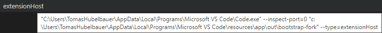

# Node Chrome DevTools Protocol Web Socket

Pure Node web socket client talking to CDP (Chrome DevTools Protocol) web socket
obtained by attaching to a process by its PID.

## Installation

`git submodule add https://github.com/tomashubelbauer/node-cdp-ws`

## Usage

### `(url: string, receive: function)`

```js
import cdp from './node-cdp-ws/index.js';

const send = await cdp('ws://localhost:9229/${guid}', console.log);

// https://chromedevtools.github.io/devtools-protocol/tot/Runtime/#method-evaluate
send({ id: 1, method: 'Runtime.evaluate', params: { expression: 'new Date().toLocaleTimeString()' } });
```

### `(pid: number, receive: function, port?: number = 9229)`

```js
import cdp from './node-cdp-ws/index.js';

const send = await cdp(process.pid, console.log);

// https://chromedevtools.github.io/devtools-protocol/tot/Runtime/#method-evaluate
send({ id: 1, method: 'Runtime.evaluate', params: { expression: 'new Date().toLocaleTimeString()' } });
```

## Development

Run using `node test`.

Use `chrome://inspect` in Chrome/Edge to be able to use dev tools to debug.

### To-Do

#### Test out with CDP methods which return large results, like Electron screenshot

https://github.com/TomasHubelbauer/electron-inspect-require

https://github.com/TomasHubelbauer/electron-self-screenshot

The `electron` example in `example` is WIP. To test with it, install Electron
globally using `npm i -g electron` and go to the `example/electron` directory
and run `electron .` or skip installing Electron globally and use the command
`npx electron .` instead of `electron .`.

The Electron application will print its PID. Split the terminal and run
`node test ${pid}` providing the printed PID. This will attach a debugger to the
Electron binary and work against it rather than own process.

- [ ] Use `node-win-pid` and pass `electron` instead of the PID and look it up

I looked through `electron-self-require` repository and it shows this snippet:

```js
const electron = process.mainModule.require('electron')
const fs = process.mainModule.require('fs')
const webContents = electron.webContents.getAllWebContents()[0] // [1] is the shared process
webContents.capturePage(image => fs.writeFileSync('screenshot.png', image.toPNG()))
// Look in `process.cwd()`
```

I used `node-win-pid` and in it `node test code.exe` to find the PID of the main
VS Code window. I then used `process._debugProcess` to put it in debug mode and
used `chrome://inspect` to open dev tools for it.

The dev tools instance for this main process PID shows one JS context:
*Electron Main Context*.

I ran `process.mainModule` in it and checked the paths and the child modules.
I didn't see anything relating to the API or the extensions.

Next up I opened `C:\Users\…\AppData\Local\Programs\Microsoft VS Code\` in Code
and searched for various API method names. I know that the main process module
path is in `resources\app\out` so I limited my search to there for now.

I was able to identity these files as potential interests:

- vs\workbench\services\extensions\node\extensionHostProcess.js
- vs\workbench\services\extensions\worker\extensionHostWorker.js

I am not sure how to get to these modules from the main process I have debug
access to. The snipped there looks useless as I'm pretty sure the access to the
API is not from the render process but from the main process in some way.

I tried running `process.mainModule.require('vscode')` to no luck in the main
process. I also tried `process.mainModule.children[${index}].require('vscode')`
for all the child modules of the main module, again, to no luck.

```js
process.mainModule.require('./vs/workbench/services/extensions/node/extensionHostProcess.js')
```

This failed in a new way: *`define` is not defined*, not *Cannot find module*.

The next step should be to attach to all `code.exe` PIDs, not just the main one,
and seeing if one of those processes has a path `extensionHostProcess.js` or has
such path in its `children` modules. Use either of:

- `tasklist /FI "ImageName eq Code.exe"`
- `wmic process get processid,executablepath|findstr Code.exe`

It always seems to return the processes in the same order (main, some 3/4 ones
which are not possible to attach to), then more processes. This is good, because
since we start the debugging externally, we cannot  close it. Normally closing
it would be done using `require('inspector').close()` but that has to be done in
the process and when doing it using the devtools at `chrome://inspect`, it does
nothing. So, we are forced to restart VS Code after each process resetting all
the PIDs, so the stable order of the processes means we do not have to try and
distinguish which processes we already checked or not. We just go one by one:

- Run `node -e "process._debugProcess(…)"` with the PID at the current index
- Check http://localhost:9229/json and verify the PID matches there
- Refresh `chrome://inspect` until it shows and verify the PID matches there
- Evaluate `process.mainModule.filename` in the dev tools and note it

The processes tried and paths found:

1. `resources\app\out\main.js`
2. unattachable
3. unattachable
4. unattachable
5. unattachable
6. undiscoverable
7. `resources\app\out\bootstrap-fork.js`
8. unattachable
9. `resources\app\extensions\json-language-features\server\dist\node\jsonServerMain.js`

*unattachable* means `process._debugProcess` throws *The system cannot find the file specified.*.

*undiscoverable* means `process._debugProcess` seemingly succeeds, but
`chome://inspect` lists nothing and http://localhost:9229 is unreachable. I have
later found this is actually the extension host process. Read on…

The test - kill Code - advance to the next index, repeat cycle has been repeated
twice to really make sure the order of the processes is always the same and it
is.

This leaves us with two processes we can control only: `main.js` and
`jsonServerMain.js`. Nothing like `extensionHostProcess.js` or anything. I guess
that means we have to find our way to the extension host process from the main
process somehow.

It is also possible that the undiscoverable process is what we need and it just
listens on a different port, but I find it unlikely and have not tested it.

It is interesting that in the main module, these commands behave differently:

`require('./vs/workbench/services/extensions/node/extensionHostProcess.js')`

Print *Cannot find module './vs/workbench/services/extensions/node/extensionHostProcess.js'*

`process.mainModule.require('./vs/workbench/services/extensions/node/extensionHostProcess.js')`

Prints *define is not defined*

I have used VS Code > Help > Process Explorer to determine the extension host
process is the one which accepts `console._debugProcess` but will not listen on
http://localhost:9229 or show up in chrome://inspect.

Also the dev tools that open in VS Code > Help > Toggle Develop Tools are for
the Electron renderer process, #3 in the PID list, unattachable.

I found something I thought might have been preventing the extension host from
being debuggable, as per https://github.com/microsoft/vscode/issues/85490 and
the commits referenced therein:

```js
,function(){for(let e=0;e<process.execArgv.length;e++)"--inspect-port=0"===process.execArgv[e]&&(process.execArgv.splice(e,1),e--)}()
```

Removing it did not help make the extension host debuggable.

I also found an interesting tooltip when hovering out the extension host in the
Process Explorer window:



This is looking kinda janky, perhaps rather than hoping to obtain the interface
object for the VS Code by attaching to the main VS Code process and navigating
our way to it, it might be easier to start VS Code with a CLI argument telling
it to also load a wrapper extension (look into making single-file extensions)
which would bootstrap the CDP WS logic, run the scenario VS Code API commands,
recognize the scenarion finishing and then would use VS Code CDP WS to capture a
screenshot and save it.

This circles back to https://github.com/TomasHubelbauer/code-extension-screencast

Use https://github.com/TomasHubelbauer/vscode-barebones-extension to decouple
the screenshot taking from test running. This way in one step, `npm test` is run
as usual, and in another, `code --extensions-dir` is invoked this way, pointing
to a directory with an extension which uses the VS Code API to carry out a demo
of whatever the user wants to demo, including the extension should they choose
to show it (by making sure the extension is also in the directory used for the
`--extensions-dir` CLI argument).
